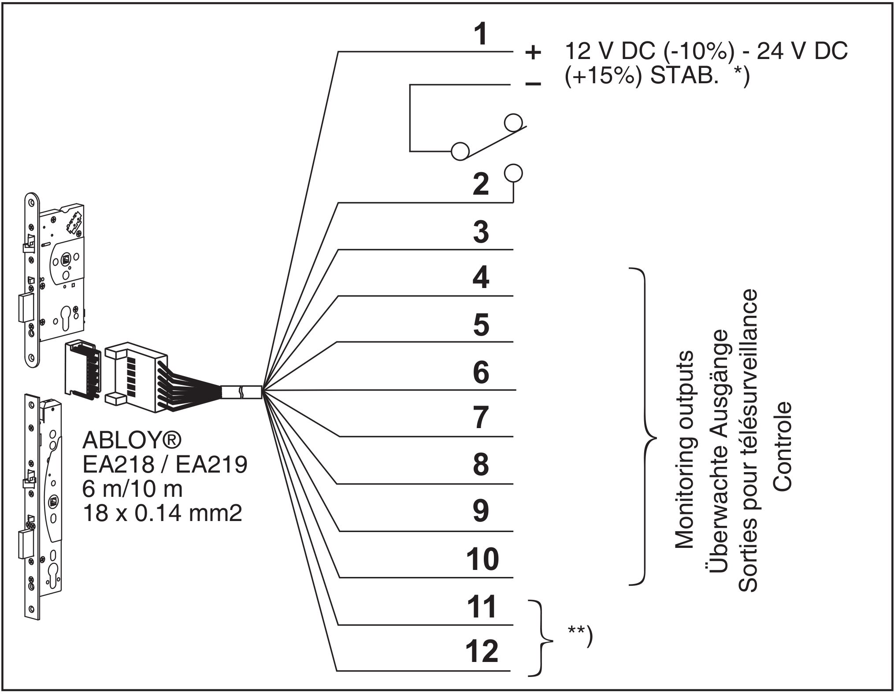

# Access control system 4 

Die Türsteuerung für die Türen im neuen Dorf auf der Sonnenstraße.

https://github.com/chaosdorf/sonnenstr58/issues/8

## Elektrisches Schloss
[Anleitung](src/Bedienungsanleitung_Sicherheitsschloss.pdf)

### Pinout

| Pin-Nummer | Kabel-Farbe | Funktion |
|--|--|--|
| 1 | Weiß + |  |
| 2 | Rot - | Geschlossen / Offen |
| 3 | Grün/Rot | Schließzylinder betätigt |
| 4 | Blau | Drücker gedrückt |
| 5 | Violett | Gemeinsamer Kontakt für Schließzylinder betätigt / Drücker gedrückt |
| 6 | Türkis | Riegel ausgefahren |
| 7 | Gelb / Rot | Gemeinsamer Kontakt für Riegel ausgefahren |
| 8 | Braun |  Steuerfalle gedrückt |
| 9 | Orange | Riegel eingefahren | 
| 10 | Gelb | Gemeinsamer Kontakt für Steuerfalle gedrückt / Riegel eingefahren | 
| 11 | Grau / Pink | Sabotage schlaufe